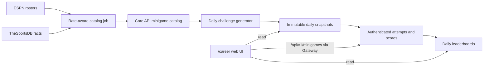

# Career Daily Minigames Design

**Status:** Approved
**Date:** 2026-08-01
**Scope:** Replace `/career` with daily football minigames.

## Understanding Summary

- `/career` replaces Career Manager entirely with two daily games: Who Am I? and Football Grid.
- ESPN supplies minigame rosters and TheSportsDB enriches historical facts; `football-data.org` remains exclusively for predictions.
- Every player sees the same challenge for a Vietnam-local day, which resets at 00:00 Asia/Ho_Chi_Minh.
- Logged-in users receive one ranked attempt per game per day, followed by unlimited unranked practice attempts.
- Who Am I? is a hybrid progressive-clue and Guess the Player game with typed, autocomplete-backed guesses.
- Football Grid accepts players who have previously played for the relevant club and never permits a player to fill two cells.
- Daily, combined, and per-game leaderboards support the initial ~1,000 daily players and should scale without increasing provider traffic per play.

## Assumptions and Non-Goals

- ESPN roster requests are rate-spaced server-side; TheSportsDB enrichment stays below its free-tier limit and supports `MINIGAME_SPORTSDB_KEY` for a dedicated key. [TheSportsDB documentation](https://www.thesportsdb.com/docs_api_guide)
- TheSportsDB is authoritative only for facts it returns. The game never infers a historical club relationship from incomplete data; player former-team, honours, and statistics endpoints provide the required facts.
- No manual curation UI, full provider mirror, streaks, sharing, archive, rarity score, notifications, or admin dashboard is in this release.
- Guests may read the rules and public leaderboard but must log in before starting an attempt; no guest attempt is persisted.
- No hard latency SLA is required. Gameplay reads only local snapshots and normal indexed database queries.

## Architecture

`/career` is a web route only. Core API owns catalog data, daily snapshots, attempts, scores, and leaderboards because it already owns users. The retired Career service and its fictional player data are not part of the minigame path.

Core stores a compact provider catalog (player ID, aliases, facts, career clubs, season stats, trophies, and source freshness), immutable daily challenges, and attempts. Public challenge payloads exclude answers, aliases, and raw provider responses. The provider key never reaches the browser.

## Provider Sync and Generation

- Bootstrap candidates from top-league team rosters, then enrich them through a small queue.
- The initial sync caps its local catalog at 1,000 players and spaces upstream requests to respect the free-tier rate limit.
- Challenge generation only queries the local catalog and maintains a seven-day buffer; it performs no provider request on a player visit.
- A Who Am I? candidate must have six non-repeating, source-backed clue types. A grid is publishable only when its nine cells have at least one all-distinct-player solution.
- Provider failure delays catalog refresh only. If the buffer is empty, return an explicit unavailable state rather than reusing or changing a ranked daily puzzle.

This keeps free-tier usage below quota, isolates API availability from play, and permits growth in player count without more external traffic.

## Gameplay

### Who Am I? × Guess the Player

- Start with one broad clue and allow up to five additional revealed clues, for six distinct types: nationality/position, club route, league and season, season statistics, trophies, and a career milestone.
- Users type a name and select an autocomplete result from the internal catalog. A valid wrong guess consumes one of six guesses and returns comparison feedback: nationality, position, current club/league, birth year, career-club count, and trophy count. Numeric facts indicate higher/lower; categorical facts state match status without relying only on color.
- Revealing a clue does not use a guess but reduces the score. A correct answer scores `max(1, 12 - 2 × revealedClues - wrongGuesses)`; no score is granted without a correct answer.
- A clue template is rejected if it embeds a player name or accepted alias.

### Football Grid

- The daily grid is 3×3: rows and columns are provider-backed criteria, initially nationality × former club.
- A player is valid when the catalog has evidence that they meet both criteria. A player named in any prior grid cell is invalid everywhere else.
- There are nine total guesses. Each submitted cell is locked whether right or wrong. Each correct cell is worth two points; the maximum is 18.
- No rarity score is calculated in the first release because meaningful rarity needs a stable volume of answer data.

## Attempts and Leaderboards

- The first attempt of each game for each user and Vietnam-local date is official. It can be resumed until complete; after completion, users may create practice attempts that never affect rank.
- A database transaction plus a unique constraint on user, local date, game, and official status ensures concurrent requests cannot create two official attempts.
- Attempt state uses a version field. A stale mutation receives a conflict and refetches the authoritative state; no request-ID event store is needed for this MVP.
- Leaderboards expose `Combined`, `Who Am I?`, and `Football Grid`, show the top 100 and the current user's rank, and resolve a point tie by earlier completion time.

## UX

- `/career` becomes **Football Daily**, with date, score, game tabs, and a leaderboard link. It no longer renders the old Career launcher or workspace.
- Logged-out visitors see game rules and public ranks; starting a game sends them to login.
- Official and practice modes are visibly distinct. End states reveal the answer and sourced facts only after that attempt is complete.
- Grid scrolls horizontally on small screens; all controls are keyboard accessible, use visible focus, and communicate state through text and shape as well as color.
- The server provides the active local date. Browser time never decides which daily puzzle a user receives.

## Reliability and Verification

Keep only four focused release checks:

1. Hybrid scoring and clue/guess limits.
2. Grid accepts valid intersections, rejects reused players, and generator proves a nine-player solution.
3. Authenticated users can create exactly one official daily attempt even under concurrent requests.
4. Public payloads never expose an answer, alias list, or API key.

The catalog job logs remaining provider quota and buffer length. Full metrics/alerts, idempotency event storage, and provider analytics are deferred until observed traffic warrants them.

## Decision Log

| Decision | Alternatives considered | Rationale |
|---|---|---|
| Replace `/career` | Keep Career Manager elsewhere; add a separate games route | The requested route is a dedicated daily-game surface. |
| ESPN rosters + TheSportsDB facts | `football-data.org`; fictional Career data | ESPN supplies enough real roster breadth for the local catalog while TheSportsDB enriches career-team, trophy, and statistics facts; predictions remain separate. |
| Local catalog and daily snapshots | Live provider calls; full provider mirror | Fits the free quota and keeps daily games fair and reliable. |
| Core API ownership | Career service; frontend-only state | Core owns user identity, attempts, score, and leaderboard data. |
| Hybrid Who Am I? and Guess the Player | Clue-only; attribute-only | Progressive facts create narrative discovery while wrong guesses teach through comparison. |
| Six guesses, six clue types | Unlimited guesses; fixed three clues | Preserves daily-game tension and clue diversity. |
| Nine locked Grid guesses | Two-error prototype; unlimited cells | Matches familiar grid gameplay and makes each cell decision meaningful. |
| Ranked first attempt plus practice | Ranked replay; no practice | Preserves fair leaderboards without blocking replay. |
| Minimal reliability mechanisms | Event IDs, dashboards, manual admin | Transactions, snapshots, and four release tests address real MVP risks with less code. |
