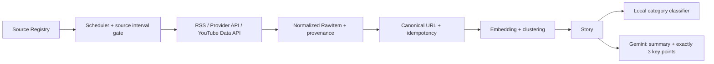

# FootballVerse News Ingestion Reliability Implementation Plan

## 1. Cách sử dụng tài liệu này

Đây là tài liệu nguồn sự thật cho đợt sửa phần thu thập tin tức. AI hoặc lập trình viên triển khai phải:

1. Làm theo thứ tự phase trong tài liệu.
2. Không đánh dấu task hoàn thành trước khi chạy check tương ứng.
3. Không xóa hoặc ghi đè thay đổi chưa commit không thuộc phạm vi.
4. Không mở rộng sang phần nâng cấp trước khi toàn bộ acceptance criteria của bugfix đạt.
5. Nếu runtime khác baseline, cập nhật mục `Execution Log` trước khi thay đổi thiết kế.

Các từ khóa `MUST`, `MUST NOT`, `SHOULD` mang nghĩa ràng buộc.

## 2. Mục tiêu

Xây dựng luồng thu thập tin bóng đá có các đặc tính:

- dữ liệu phản ánh đúng nguồn thực;
- lỗi HTTP/API không bị ghi thành một lần crawl thành công;
- raw item được chuẩn hóa và chống trùng trước khi tạo story;
- YouTube được lấy bằng YouTube Data API v3 mỗi 60 phút;
- Gemini chỉ tạo `summary` và đúng 3 `keyPoints`;
- `category` được phân loại cục bộ;
- lỗi hoặc quota Gemini không làm mất raw item;
- không thêm hạ tầng khi PostgreSQL và spool hiện tại đã đủ.

## 3. Các quyết định đã khóa

| ID | Quyết định |
|---|---|
| DEC-001 | Giữ hai service hiện tại: Content Ingestion và Core API. |
| DEC-002 | PostgreSQL tiếp tục là nguồn sự thật; không thêm Kafka, RabbitMQ hoặc vector database khác. |
| DEC-003 | RSS/API/YouTube adapters chỉ fetch, kiểm tra response và chuẩn hóa `RawItem`. |
| DEC-004 | X và Reddit MUST NOT fallback sang Google News rồi giữ provider cũ. |
| DEC-005 | Google News, X và Reddit là nguồn discovery mặc định; trạng thái official chỉ được cấp khi publisher thực đã được xác minh. |
| DEC-006 | YouTube dùng Data API v3, theo dõi uploads playlist, không dùng `search.list`. |
| DEC-007 | YouTube có `fetchIntervalSeconds = 3600`; các nguồn khác giữ cadence hiện tại trừ khi có quyết định riêng. |
| DEC-008 | Gemini chỉ trả `summary` và đúng 3 `keyPoints`; không trả category. |
| DEC-009 | `NewsCategoryClassifierService` là nguồn duy nhất phân loại category cho story tự động. |
| DEC-010 | Bugfix giữ Gemini đồng bộ với circuit breaker và timeout phù hợp; xử lý AI bất đồng bộ là nâng cấp sau acceptance. |
| DEC-011 | Crawl nguồn vẫn tuần tự trong bugfix vì baseline dưới 2 phút; chỉ thêm concurrency khi có số liệu chứng minh cần thiết. |
| DEC-012 | Không xóa dữ liệu lịch sử. Mọi backfill provenance phải bảo toàn raw item và story. |

## 4. Phạm vi và ngoài phạm vi

### 4.1 Trong phạm vi bugfix

- HTTP status/error propagation của adapters.
- X/Reddit fallback và provenance.
- Nguồn RSS hỏng đã xác minh.
- Chuyển YouTube Atom feed sang YouTube Data API.
- Cadence theo `fetchIntervalSeconds`, đặc biệt YouTube 60 phút.
- Gemini contract, quota guard, circuit breaker và timeout.
- Category classifier cục bộ.
- Migration bảo toàn dữ liệu cho source/provenance/verification.
- Unit test, integration test và Docker smoke test.

### 4.2 Ngoài phạm vi bugfix

- Broker/message bus mới.
- Microservice AI riêng.
- Crawl full-text HTML mới.
- Thay mô hình embedding hoặc thuật toán clustering đang hoạt động.
- HNSW hoặc vector database mới.
- Dashboard lớn hoặc admin workflow mới.
- Tăng concurrency khi chưa có bottleneck đo được.
- Xóa story/raw item lịch sử.

## 5. Baseline runtime đã xác minh

Thời điểm đo: 2026-08-02, Docker local.

| Chỉ số | Kết quả |
|---|---:|
| Active sources | 68 |
| Thời gian một crawl cycle | khoảng 69–70 giây |
| Items collected trong manual cycle | 1.089 |
| Items enqueued trong manual cycle | 372 |
| Crawl kế tiếp | khoảng 999 collected, 0 enqueued |
| Spool backlog sau khi drain | 0 |
| Gemini thành công trong mẫu log | 21 |
| Gemini HTTP 429 trong mẫu log | 196 |
| Core import timeout quan sát được | 3 |
| Worker Core request timeout hiện tại | 10 giây |
| Gemini connect/read timeout hiện tại | 8/12 giây |

Kết luận baseline:

- deduplication và spool cơ bản hoạt động;
- crawl tuần tự hiện chưa phải lỗi hiệu năng;
- lỗi ưu tiên là provenance, adapter error handling và Gemini quota/timeout.

### 5.1 Nguồn lỗi đã xác minh

RSS:

| Source ID tại môi trường kiểm tra | Tên | Kết quả |
|---:|---|---|
| 6 | Football Italia | timeout |
| 101 | Football365 | HTTP 404 |
| 102 | TeamTalk Football | HTTP 404 |
| 104 | AS English | HTTP 404 |

YouTube Atom feed:

- hoạt động: source IDs `67`, `80`, `81`;
- HTTP 404: source IDs `68`, `69`, `70`, `71`, `72`, `76`, `77`, `78`, `79`, `82`, `83`, `84`, `85`.

Migration MUST target stable attributes như `name`, `provider`, `feed_url`; MUST NOT phụ thuộc duy nhất vào numeric IDs ở trên.

### 5.2 Provenance sai đã xác minh

- Toàn bộ raw item provider `reddit` trong mẫu runtime mang URL `news.google.com`.
- Toàn bộ raw item provider `x` trong mẫu runtime mang URL `news.google.com`.
- GNews raw items cũng mang URL Google News thay vì publisher đích.
- Kết quả hiện tại có thể nâng verification sai vì story dùng publisher của connector.

## 6. Kiến trúc đích



### 6.1 Provenance invariant

Mọi story MUST truy ngược được theo chuỗi:

```text
Story -> RawItem -> Connector -> Publisher -> Original URL
```

Các invariant bắt buộc:

- `RawItem.provider` mô tả provider thật đã trả dữ liệu.
- `RawItem.originalUrl` là URL nội dung/video gốc khi có thể xác định.
- Connector discovery không được biến thành publisher nội dung.
- `OFFICIAL` chỉ được suy ra từ publisher thực đã được xác minh.
- Không dùng số lượng source hoặc semantic clustering để tự động nâng lên `OFFICIAL`.

### 6.2 Raw item contract

Contract hiện tại tiếp tục được dùng:

```text
sourceId / connectorId
provider
externalId
identityKey
revisionFingerprint
originalUrl
canonicalUrl
title
description
author
publishedAt
language
media
```

Không tạo contract version mới chỉ để chuyển YouTube sang Data API.

## 7. Kế hoạch triển khai bugfix

## Phase 0 — Preflight và bảo vệ thay đổi hiện có

### NEWS-000 — Chụp baseline trước khi sửa

**Thực hiện**

- Ghi `git status --short` và không đụng các file ngoài phạm vi.
- Xác nhận migration hiện tại cao nhất trước khi tạo migration mới; tại thời điểm lập kế hoạch là `V56`.
- Chạy test hiện tại của Content Ingestion và test liên quan news/Gemini của Core.
- Lưu số lượng spool state, raw item, story và verification trước migration.

**Hoàn thành khi**

- Có baseline pass/fail được ghi trong `Execution Log`.
- Không có thay đổi người dùng bị ghi đè.

## Phase 1 — Sửa adapter và provenance tương lai

### NEWS-101 — Không nuốt HTTP/provider errors

**Root cause**

`secureFetchText` cố ý trả response non-2xx để adapter tự quyết định. `RssAdapter` đã chuyển non-2xx thành lỗi, nhưng YouTube/GNews và một số nhánh provider chưa làm nhất quán; `YouTubeAdapter` còn catch rồi trả empty success.

**Thực hiện**

- Reuse cách tạo lỗi và `retryAfterMs` đang có trong `rss-adapter.ts`.
- Adapter MUST throw khi HTTP không phải 2xx, ngoại trừ `304` ở adapter hỗ trợ conditional GET.
- `429` và `503` SHOULD truyền `Retry-After` vào `retryAfterMs` để worker dùng `deferSourceUntil` hiện có.
- Lỗi parse response MUST throw.
- Response 2xx hợp lệ nhưng không có item được ghi là successful empty; không đồng nhất nó với `notModified`.
- Xóa catch biến lỗi thành `emptyResult` trong YouTube adapter.

**File dự kiến**

```text
services/content-ingestion/src/adapters/youtube-adapter.ts
services/content-ingestion/src/adapters/gnews-adapter.ts
services/content-ingestion/src/adapters/reddit-adapter.ts
services/content-ingestion/src/adapters/x-adapter.ts
services/content-ingestion/test/*adapter*.test.*
```

**Check nhỏ nhất**

- Mỗi adapter có một test non-2xx => rejected/throw.
- Một test 2xx empty => không throw và không bị đánh dấu `notModified` giả.

### NEWS-102 — Xóa fallback giả danh X/Reddit

**Thực hiện**

- X adapter chỉ trả item lấy thực sự từ X.
- Reddit adapter chỉ trả item lấy thực sự từ Reddit.
- API/token lỗi hoặc response lỗi MUST throw.
- API trả danh sách rỗng hợp lệ được ghi successful empty.
- MUST NOT gọi GNews từ X/Reddit adapters.
- MUST NOT tạo author/provider giả khi fallback.

**Hoàn thành khi**

- Không còn chuỗi `Using GNews fallback` hoặc logic GNews fallback trong hai adapter.
- Test chứng minh provider lỗi không tạo item mang URL Google News.

### NEWS-103 — Backfill provenance lịch sử có kiểm soát

**Thực hiện**

- Tạo `V57` cho cadence/provenance; dùng `V58` và `V59` để backfill verification sau khi dữ liệu legacy được phân loại; dùng `V60` để sửa duplicate raw identity phát hiện trong live acceptance.
- Tạo hoặc reuse một connector/publisher không official cho dữ liệu `Google News fallback (legacy)`.
- Reassign các raw item có `provider IN ('x','reddit')` và host `original_url = news.google.com` sang provenance legacy phù hợp.
- Downgrade story liên quan về `SINGLE_REPORT` trừ khi có một raw item official thật khác hỗ trợ story.
- Cập nhật hero/source projection nếu nó đang trỏ vào connector giả danh.
- Không xóa raw item, story, story membership hoặc cluster decision.
- Trước khi viết SQL update, chạy SELECT cùng điều kiện và ghi số dòng dự kiến.

**Safety rule**

Không mass-update publisher chỉ vì publisher có một social connector; publisher có thể đồng thời được dùng bởi official RSS. Điều kiện backfill phải dựa trên URL/provider sai đã xác minh.

**Hoàn thành khi**

- Không có legacy story chỉ dựa trên Google News fallback còn `OFFICIAL`.
- Số raw item và story không giảm.

### NEWS-104 — Xử lý RSS hỏng

**Thực hiện**

- Tạm disable bốn nguồn RSS hỏng đã xác minh bằng stable name/feed URL.
- Chỉ thay endpoint khi endpoint mới trả 2xx và parse được trong container.
- Không chuyển sang HTML scraping chỉ để giữ nguồn hoạt động.

**Hoàn thành khi**

- Crawl cycle không lặp lại 404/timeout từ bốn endpoint cũ.
- Nguồn thay thế, nếu có, có test parse và provenance đúng.

## Phase 2 — YouTube Data API mỗi 60 phút

### NEWS-201 — Thay Atom feed bằng YouTube Data API v3

**Luồng bắt buộc**

```text
channelId
  -> channels.list(part=contentDetails)
  -> contentDetails.relatedPlaylists.uploads
  -> playlistItems.list(part=snippet,contentDetails,status)
  -> NormalizedItemV1
```

**Thực hiện**

- Thêm secret `YOUTUBE_DATA_API_KEY` vào `.env.example` và environment của `content-ingestion` trong Compose.
- Không log API key hoặc URL chứa API key.
- Parse `channelId` từ `channel_id` trong feed URL hiện có hoặc một canonical channel URL; không cần đổi schema nguồn chỉ để lưu channel ID.
- Cache `uploadsPlaylistId` theo `channelId` trong instance `YouTubeAdapter`; registry hiện đã giữ một adapter instance dùng lại.
- Gọi `channels.list` một lần cho mỗi channel trong vòng đời process, rồi dùng `playlistItems.list` cho các crawl sau.
- Không dùng `search.list`.
- Lấy 10–20 video mới nhất; API cho phép tối đa 50 nhưng không cần lấy 50 mỗi giờ.
- Dùng `videoId` làm `externalId` và identity component.
- `originalUrl` và `canonicalUrl` phải là `https://www.youtube.com/watch?v={videoId}`.
- Giữ filter highlight hiện tại; sửa encoding của pattern nếu test cho thấy chuỗi tiếng Việt đang hỏng.
- Nếu checkpoint cursor đã gặp `videoId`, adapter có thể dừng đọc phần cũ; database idempotency vẫn là lớp bảo vệ cuối.

**Quota dự kiến**

```text
16 channels * 24 playlist calls/day = 384 playlist calls/day
```

`channels.list` chỉ phát sinh lần đầu mỗi process/channel. Chỉ thêm `videos.list` khi metadata từ playlist không đủ cho yêu cầu sản phẩm đã có; không gọi vì dự phòng.

**Error policy**

| Response | Hành vi |
|---|---|
| 200 | Parse và normalize. |
| 400 | Fail source; cấu hình/request sai. |
| 403 quota exceeded | Defer đến cửa sổ quota tiếp theo; không fallback. |
| 404 | Fail source; channel/playlist không hợp lệ. |
| 429 | Defer theo `Retry-After` hoặc bounded backoff. |
| 5xx/timeout | Throw để worker ghi failed và retry có backoff. |

**Tài liệu API chính thức**

- https://developers.google.com/youtube/v3/guides/implementation/channels
- https://developers.google.com/youtube/v3/docs/playlistItems/list
- https://developers.google.com/youtube/v3/getting-started

### NEWS-202 — Kích hoạt cadence theo source

**Existing capability phải reuse**

`news_sources.fetch_interval_seconds` đã tồn tại nhưng chưa được đưa qua DTO/worker.

**Thực hiện**

- Thêm `fetchIntervalSeconds` vào `NewsSourceResponse` và `SourceDescriptor`.
- Reuse `source_checkpoints.last_success_at` trong ingestion database để quyết định source đã đến hạn chưa.
- Mở rộng readiness check hiện có thay vì tạo scheduler riêng cho YouTube.
- Update các source `provider='youtube'` thành `fetch_interval_seconds = 3600` bằng migration.
- Startup crawl chỉ gọi YouTube nếu source chưa có success trong 60 phút gần nhất.
- Global cron 15 phút có thể giữ nguyên; interval gate sẽ khiến YouTube chỉ chạy mỗi giờ.

**Hoàn thành khi**

- Trong cửa sổ 60 phút, mỗi YouTube source có tối đa một successful API collection.
- RSS/provider khác vẫn chạy theo interval của chính nó.
- Restart worker không gây gọi YouTube lặp nếu checkpoint còn mới.

### NEWS-203 — Xác minh channel configuration

**Thực hiện**

- Kiểm tra từng channel bằng `channels.list` trước khi active.
- Nguồn trả 404 phải bị disable cho đến khi có channel ID chính xác.
- Không suy đoán hoặc seed channel ID chưa được API xác nhận.
- Publisher official chỉ giữ cho channel thực sự thuộc CLB/giải đấu/đơn vị được ghi tên.

## Phase 3 — Gemini đúng phạm vi và chịu lỗi

### NEWS-301 — Khóa Gemini output contract

**Contract mới**

```java
SummaryResult(
    String summary,
    List<String> keyPoints,
    boolean aiGenerated
)
```

**Prompt output**

```json
{
  "summary": "...",
  "keyPoints": ["...", "...", "..."]
}
```

**Thực hiện**

- Xóa `category` khỏi prompt, JSON schema và `SummaryResult`.
- AI result chỉ hợp lệ khi summary không blank và có đúng 3 key point không blank.
- Output sai contract dùng deterministic fallback hiện có và `aiGenerated=false`.
- Fallback cũng trả đúng 3 key points để projection không bị thiếu dữ liệu.
- `RawItemImportService` không truyền AI category hint.
- `NewsCategoryClassifierService.classify(title, content)` là đường phân loại story tự động duy nhất.
- Giữ `mapCategoryNameToSlug` nếu `CrawlService` còn dùng cho category được cung cấp rõ ràng từ non-Gemini import.

**File dự kiến**

```text
services/core-api/src/main/java/com/footballverse/news/service/AiSummaryService.java
services/core-api/src/main/java/com/footballverse/news/service/RawItemImportService.java
services/core-api/src/main/java/com/footballverse/news/service/NewsCategoryClassifierService.java
services/core-api/src/main/java/com/footballverse/news/service/CrawlService.java
services/core-api/src/test/java/com/footballverse/news/service/AiSummaryServiceTest.java
```

### NEWS-302 — Chặn Gemini quota storm

**Root cause**

Counter hiện chỉ tăng sau HTTP response thành công. Request trả 429 không được tính nên Core tiếp tục gọi Gemini cho mọi story.

**Thực hiện**

- Tăng attempt counter trước khi gửi request.
- Giữ daily limit cấu hình được; đặt default triển khai phù hợp quota hiện tại, dự kiến 20.
- Thêm `blockedUntil` trong memory bằng JDK time/atomic primitives; không thêm resilience dependency.
- Khi nhận 429, đọc `Retry-After`, đặt `blockedUntil` và trả fallback.
- Trong thời gian blocked, không gửi request mới.
- Khi không có `Retry-After`, dùng bounded fallback delay.
- Reset daily counter theo ngày như hiện tại.
- Log model, result state và blocked-until; không log API key hoặc toàn bộ article body.

**Check nhỏ nhất**

- Test hai lời gọi liên tiếp: lần đầu trả 429, lần sau không chạm fake HTTP server trong cửa sổ block.
- Test counter tính cả HTTP failure attempt.

### NEWS-303 — Đồng bộ timeout

**Thực hiện bugfix tối thiểu**

- Giữ Gemini connect/read timeout có giới hạn.
- Tăng Content Ingestion -> Core import timeout từ 10 giây lên một giá trị lớn hơn tổng Gemini timeout và Core overhead; default đề xuất 30 giây.
- Timeout phải cấu hình được bằng env, không hard-code rải rác.
- Không retry request import ngay lập tức ở nhiều lớp; durable spool hiện tại chịu trách nhiệm retry.

**Hoàn thành khi**

- Không còn `Spool item import failed: ETIMEDOUT` trong acceptance crawl do Gemini vẫn đang chạy hợp lệ.

## Phase 4 — Docker acceptance

### NEWS-401 — Automated checks

Chạy tối thiểu:

```powershell
Set-Location services/content-ingestion
npm.cmd test

Set-Location ../core-api
mvn.cmd -q "-Dtest=AiSummaryServiceTest,RawItemImportIntegrationTest" test
```

Nếu wrapper không tồn tại, dùng Maven command đã được repository quy định. Không tự ý bỏ test lỗi.

### NEWS-402 — Integrated Docker checks

Khởi động tối thiểu:

```powershell
docker compose up -d postgres redis core-service content-ingestion
```

Thực hiện:

1. Chờ health checks pass.
2. Ghi database counts trước crawl.
3. Trigger crawl lần 1 và chờ spool drain.
4. Trigger crawl lần 2 trong cùng dữ liệu nguồn và chờ spool drain.
5. Kiểm tra source sync outcomes, Core logs, Gemini calls và provenance bằng SQL.
6. Theo dõi thêm ít nhất một cửa sổ YouTube 60 phút hoặc dùng clock/test hook trong automated integration test; không giảm interval production chỉ để test thủ công.

### NEWS-403 — Acceptance criteria

- [x] Non-2xx và parse error được ghi `FAILED`, không phải successful empty.
- [x] Không có item mới provider X/Reddit mang URL Google News (`bad_social_urls=0`).
- [x] Không còn code path GNews fallback trong X/Reddit adapters.
- [x] Bốn RSS hỏng đã bị disable khỏi active crawl set.
- [x] YouTube adapter dùng YouTube Data API v3; không còn Atom fallback.
- [x] YouTube source có `fetch_interval_seconds=3600` và checkpoint persisted; crawl ngay sau đó log `deferred until` sau 60 phút.
- [x] Không dùng YouTube `search.list`; dùng uploads playlist.
- [x] Video dùng `videoId` làm external ID và canonical watch URL (mock API test pass).
- [x] Gemini output contract chỉ gồm summary và đúng 3 key points.
- [x] Category story tự động đến từ local classifier.
- [x] Sau một Gemini 429, không có request Gemini mới trước `blockedUntil` (unit test pass).
- [x] Core import timeout mặc định đã đồng bộ ở 30 giây và có env override.
- [x] Legacy Google News fallback stories không còn official nếu thiếu official publisher (`official_without_official_publisher=0`).
- [x] Migration không xóa raw item, story hoặc membership; duplicate source URL sau backfill = 0.
- [x] Crawl hoàn thành dưới 2 phút ở baseline workload (khoảng 18 giây cho forced cycle).
- [x] Spool không còn `PENDING`/`PROCESSING` sau crawl (`ACCEPTED=6568`, `SKIPPED=358`).
- [x] Crawl lặp không tạo raw/story trùng; live YouTube crawl thứ hai `enqueued=0`, identity duplicate groups = 0 sau V60.
- [x] Automated tests liên quan pass: content-ingestion 27 tests; Core targeted tests pass.
- [x] Live YouTube API acceptance: runtime nhận `YOUTUBE_DATA_API_KEY`, 3 channel trả 19 video mới; 13 channel không có uploads playlist được ghi `FAILED` đúng, không fallback.

## 8. Rollout và rollback

### 8.1 Thứ tự rollout

1. Deploy Core DTO/category/Gemini compatibility trước nếu ingestion contract thay đổi.
2. Deploy Content Ingestion adapter/error handling.
3. Cấu hình `YOUTUBE_DATA_API_KEY`.
4. Chạy migration source interval/provenance.
5. Enable lại từng YouTube source đã xác minh.
6. Chạy Docker acceptance.

### 8.2 Rollback an toàn

- Có thể disable provider/source qua `news_sources.active` mà không xóa dữ liệu.
- Có thể bỏ API key để YouTube fail closed; MUST NOT tự fallback về Atom/GNews.
- Nếu Gemini lỗi, tắt key hoặc đặt local daily limit về 0 để dùng fallback; ingestion vẫn tiếp tục.
- Migration backfill không được thiết kế dựa trên rollback xóa dữ liệu. Trước update phải ghi row counts và có SQL đối chiếu provenance sau migration.

## 9. Nâng cấp sau bugfix — chưa triển khai

Chỉ bắt đầu khi toàn bộ `NEWS-403` pass.

### UPG-001 — Gemini enrichment bất đồng bộ

- Lưu story trước.
- Dùng PostgreSQL job/outbox table và scheduled worker hiện có.
- Gemini enrichment chạy sau commit.
- Retry bounded và idempotent theo story/revision.
- Không thêm broker cho đến khi PostgreSQL queue không đáp ứng throughput đo được.

### UPG-002 — Adaptive source scheduling

- Điều chỉnh interval dựa trên tần suất có item mới và lịch sử lỗi.
- Giữ minimum/maximum interval rõ ràng.
- Không triển khai nếu fixed intervals vẫn đạt freshness SLA.

### UPG-003 — Bounded collection concurrency

- Chỉ thêm khi p95 crawl vượt SLA hoặc source count tăng đáng kể.
- Giới hạn concurrency theo host/provider.
- Giữ source lease và rate-limit semantics hiện có.

### UPG-004 — Resource optimization

- Profile ingestion memory trước.
- Chỉ tối ưu model/worker lifecycle nếu mức RAM cao tái diễn và gây tác động vận hành.

## 10. Rủi ro và kiểm soát

| Rủi ro | Kiểm soát |
|---|---|
| API key YouTube bị lộ | Chỉ qua env/secret; không log URL có key. |
| Quota YouTube hết | Hourly cadence, uploads playlist, không `search.list`, defer khi quota exceeded. |
| False official | Provenance theo publisher thật; backfill legacy và recompute verification. |
| Gemini quota storm | Count attempts, daily limit, `blockedUntil`, `Retry-After`. |
| Story mất khi AI lỗi | Durable spool và deterministic fallback; async enrichment chỉ ở upgrade. |
| Migration sửa quá rộng | Target stable URL/provider conditions; SELECT count trước UPDATE; không delete. |
| Restart gây fetch YouTube dồn | Interval gate dựa trên persisted `last_success_at`. |
| Scope creep | Upgrade gate và danh sách ngoài phạm vi trong tài liệu này. |

## 11. Execution Log

AI triển khai phải thêm dòng, không xóa lịch sử.

| Date | Task | Status | Evidence / command | Notes |
|---|---|---|---|---|
| 2026-08-03 | PLAN | BUGFIX_COMPLETE_UPGRADE_GATE_CLOSED | Runtime audit + user decisions | Bugfix đã đạt acceptance; upgrade gate mở về mặt kỹ thuật nhưng chưa triển khai upgrade. |
| 2026-08-03 | SOURCE_ADAPTERS | DONE | `npm.cmd test` trong `services/content-ingestion` — 27 pass | X/Reddit không fallback; HTTP/API lỗi được ghi failed. |
| 2026-08-03 | YOUTUBE | DONE | Live Docker crawl trả 19 video mới từ 3 channel hợp lệ; 39 raw YouTube có canonical watch URL | 13 channel cấu hình không có uploads playlist nên FAILED đúng; không dùng Atom fallback. |
| 2026-08-03 | GEMINI_AND_CORE_IMPORT | DONE | `mvn.cmd -q "-Dtest=AiSummaryServiceTest,RawItemImportIntegrationTest" test` — pass | Gemini chỉ summary + 3 key points; category do local classifier. |
| 2026-08-03 | MIGRATIONS | DONE | Docker Flyway v57, v58, v59, v60 applied; duplicate source URL = 0; official thiếu official publisher = 0 | Không xóa dữ liệu lịch sử; legacy được chuyển sang publisher/source legacy. |
| 2026-08-03 | DOCKER_ACCEPTANCE | DONE | `docker compose ps`: postgres/content-ingestion healthy; live crawl khoảng 18 giây; spool chỉ ACCEPTED/SKIPPED | Core khởi động ở Flyway v60; warning prediction-service là service ngoài bộ acceptance tối thiểu. |
| 2026-08-03 | RAW_IDEMPOTENCY | DONE | V60 applied; heap scan identity/provider-external duplicate groups = 0; crawl YouTube lặp `collected=19,enqueued=0` | Giữ raw history, namespace bản ghi cũ và rebuild unique indexes. |
| 2026-08-03 | YOUTUBE_CADENCE | DONE | Crawl ngay sau lần live trước: source 67/80/81 không tạo sync mới, log defer tới sau 60 phút | Không giảm interval production để test. |
| 2026-08-03 | FULL_TEST_SUITE | PARTIAL | 30 Surefire reports; 1 failure có sẵn ở `ClusterScorerTest` (`TRANSFER_AGREEMENT` vs `TRANSFER_OFFICIAL`) | Không thuộc phạm vi news-ingestion bugfix; targeted tests và ingestion suite pass. |

## 12. Definition of Done

Đợt bugfix chỉ được coi hoàn thành khi:

1. Toàn bộ checkbox `NEWS-403` pass.
2. Test tự động liên quan pass.
3. Hai crawl liên tiếp bằng Docker pass và spool drain.
4. SQL kiểm tra provenance/verification không còn vi phạm đã mô tả.
5. Execution Log có evidence thực tế.
6. Không có hạng mục upgrade nào được trộn vào bugfix ngoài quyết định mới được ghi rõ.
